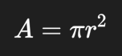

# Домашнее задание | 3. Переменные и объекты

- [Задание 0](#задание-0)
- [Задание 1](#задание-1)
- [Задание 2](#задание-2)
- [Задание 3](#задание-3)
- [Задание 4](#задание-4)
- [Задание 5](#задание-5)
- [Задание 6](#задание-6)
- [Задание 7](#задание-7)
- [Задание 8](#задание-8)
- [Задание 9](#задание-9)
- [Задание 10](#задание-10)

---

## [Задание 0](task_0.py)

Напишите программу, которая запрашивает у пользователя две строки и объединяет их в одну,
разделяя символом `-`(дефис).

**Примеры:**

| Ввод                                                          | Вывод                  |
|:--------------------------------------------------------------|:-----------------------|
| Введите первую строку: python Введите вторую строку: java | Результат: python-java |

---

## [Задание 1](task_1.py)

Напишите программу, которая запрашивает у пользователя два числа и выводит на экран их среднее арифметическое.

**Примеры:**

| Ввод                                                 | Вывод                                              |
|:-----------------------------------------------------|:---------------------------------------------------|
| Введите первое число: 7 Введите второе число: 19 | Среднее арифметическое чисел 7.0 и 19.0 равно 13.0 |

---

## [Задание 2](task_2.py)

Напишите программу, которая запрашивает у пользователя строку и число, затем выводит эту строку указанное число раз.

**Примеры:**

| Ввод                                                     | Вывод                                                                                                                                                               |
|:---------------------------------------------------------|:--------------------------------------------------------------------------------------------------------------------------------------------------------------------|
| Введите строку: Это новая строка :) Введите число: 7 | Это новая строка :) Это новая строка :) Это новая строка :) Это новая строка :) Это новая строка :) Это новая строка :) Это новая строка :) |

---

## [Задание 3](task_3.py)

Напишите программу, которая запрашивает у пользователя радиус круга (дробное число), вычисляет площадь круга и выводит
результат в формате:

- Площадь круга равна `<значение_площади>`.

> **Примечание**:
>
> - Для вычисления используйте следующее значение: `pi = 3.14159`.
> - Формула нахождения площади круга:
> - 

**Примеры:**

| Ввод                      | Вывод                                  |
|:--------------------------|:---------------------------------------|
| Введите радиус круга: 9.4 | Площадь круга равна 277.59089240000003 |

---

## [Задание 4](task_4.py)

Напишите программу, которая запрашивает у пользователя его имя и возраст (целое число), а затем выводит приветственное
сообщение в формате:

- Привет, `<имя>`! Тебе уже `<возраст>` лет!.

**Примеры:**

| Ввод                                               | Вывод                          |
|:---------------------------------------------------|:-------------------------------|
| Введите ваше имя: Иван Введите ваш возраст: 18 | Привет, Иван! Тебе уже 18 лет! |

---

## [Задание 5](task_5.py)

Напишите программу, которая запрашивает у пользователя два целых числа, а затем выводит на экран результаты всех
арифметических операций `+`, `-`, `*`, `/` над этими числами.

> **Примечание**:
>
> - Гарантируется, что второе число не будет равно `0`.

**Примеры:**

| Ввод                                                 | Вывод                                                                                                                                          |
|:-----------------------------------------------------|------------------------------------------------------------------------------------------------------------------------------------------------|
| Введите первое число: 48 Введите второе число: 4 | 48&#160;+&#160;4&#160;=&#160;52 48&#160;-&#160;4&#160;=&#160;44 48&#160;*&#160;4&#160;=&#160;192 48&#160;/&#160;4&#160;=&#160;12.0 |

| Ввод                                                  | Вывод                                                                                                                                                 |
|:------------------------------------------------------|-------------------------------------------------------------------------------------------------------------------------------------------------------|
| Введите первое число: -20 Введите второе число: 5 | -20&#160;+&#160;5&#160;=&#160;-15 -20&#160;-&#160;5&#160;=&#160;-25 -20&#160;*&#160;5&#160;=&#160;-100 -20&#160;/&#160;5&#160;=&#160;-4.0 |

---

## [Задание 6](task_6.py)

Напишите программу, которая запрашивает у пользователя два числа и выводит на экран остаток от деления первого числа на
второе.

> **Примечание**:
>
> - Гарантируется, что второе число не будет равно `0`.

**Примеры:**

| Ввод                                                 | Вывод                              |
|:-----------------------------------------------------|:-----------------------------------|
| Введите первое число: 75 Введите второе число: 6 | Остаток от деления 75 на 6 равен 3 |

---

## [Задание 7](task_7.py)

Напишите программу, которая запрашивает у пользователя следующие данные о вакансии:

- Название вакансии
- Размер ожидаемой заработной платы в рублях
- Количество рабочих часов в неделю

Программа должна вывести на экран информацию о размере оплаты за час работы в следующем формате:

- По вакансии `<название_вакансии>` вы будете получать `<размер_оплаты_в_час>` руб. в час.

> **Примечание**:
>
> - Для решения этой задачи, предположите, что график работы 5/2.

**Примеры:**

| Ввод                                                                                                                                                                                  | Вывод                                                                                                                   |
|:--------------------------------------------------------------------------------------------------------------------------------------------------------------------------------------|:------------------------------------------------------------------------------------------------------------------------|
| Название&#160;вакансии:&#160;Бэкенд&#160;разработчик Размер&#160;заработной&#160;платы&#160;(руб):&#160;120000 Количество&#160;рабочих&#160;часов&#160;в&#160;неделю:&#160;40 | По&#160;вакансии&#160;"Бэкенд&#160;разработчик"&#160;вы&#160;будете&#160;получать&#160;375.0&#160;руб.&#160;в&#160;час. |

| Ввод                                                                                                                                                                                   | Вывод                                                                                                                      |
|:---------------------------------------------------------------------------------------------------------------------------------------------------------------------------------------|:---------------------------------------------------------------------------------------------------------------------------|
| Название&#160;вакансии:&#160;Ведущий&#160;разработчик Размер&#160;заработной&#160;платы&#160;(руб):&#160;320000 Количество&#160;рабочих&#160;часов&#160;в&#160;неделю:&#160;40 | По&#160;вакансии&#160;"Ведущий&#160;разработчик"&#160;вы&#160;будете&#160;получать&#160;1000.0&#160;руб.&#160;в&#160;час.. |

---

## [Задание 8](task_8.py)

Напишите программу для конвертации температуры из градусов Цельсия в градусы Фаренгейта.

Программа запрашивает у пользователя температуру в градусах Цельсия и выводить сообщение в
формате:

- Температура `<градусы_Цельсия>`C по Фаренгейту `<температура_по_Фаренгейту>`F.

**Примеры:**

| Ввод                                                                | Вывод                                                    |
|:--------------------------------------------------------------------|:---------------------------------------------------------|
| Введите&#160;температуру&#160;в&#160;градусах&#160;Цельсия:&#160;30 | Температура&#160;30C&#160;по&#160;Фаренгейту&#160;86.0F. |

| Ввод                                                                 | Вывод                                                      |
|:---------------------------------------------------------------------|:-----------------------------------------------------------|
| Введите&#160;температуру&#160;в&#160;градусах&#160;Цельсия:&#160;-28 | Температура&#160;-28C&#160;по&#160;Фаренгейту&#160;-18.4F. |

---

## [Задание 9](task_9.py)

Напишите программу, которая запрашивает у пользователя число и выводит на экран его квадратный корень.

> Примечание:
>
> - Гарантируется число будет больше `0`.

**Примеры:**

| Ввод             | Вывод                                 |
|:-----------------|:--------------------------------------|
| Введите число: 9 | Квадратный корень числа 9.0 равен 3.0 |

| Ввод             | Вывод                                                |
|:-----------------|:-----------------------------------------------------|
| Введите число: 2 | Квадратный корень числа 2.0 равен 1.4142135623730951 |

| Ввод                            | Вывод                                                                                |
|:--------------------------------|:-------------------------------------------------------------------------------------|
| Введите&#160;число:&#160;100.45 | Квадратный&#160;корень&#160;числа&#160;100.45&#160;равен&#160;10.022474744293447  |

---

## [Задание 10](task_10.py)

Напишите программу, которая запрашивает у пользователя его имя, фамилию и возраст, а затем выводит на экран их типы и
идентификаторы в памяти.

**Примеры:**

| Ввод                                                                                | Вывод                                                                                                                                                                       |
|:------------------------------------------------------------------------------------|:----------------------------------------------------------------------------------------------------------------------------------------------------------------------------|
| Введите ваше имя: Иван Введите вашу фамилию: Иванов Введите ваш возраст: 30 | Тип имени: <class 'str'>, ID в памяти: 1937117485488 Тип фамилии: <class 'str'>, ID в памяти: 1937117482800 Тип возраста: <class 'int'>, ID в памяти: 1937111843984 |

---
